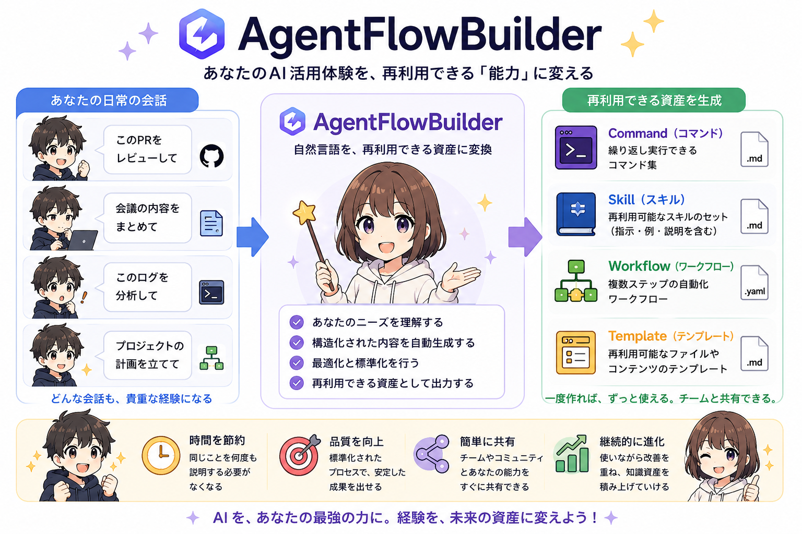
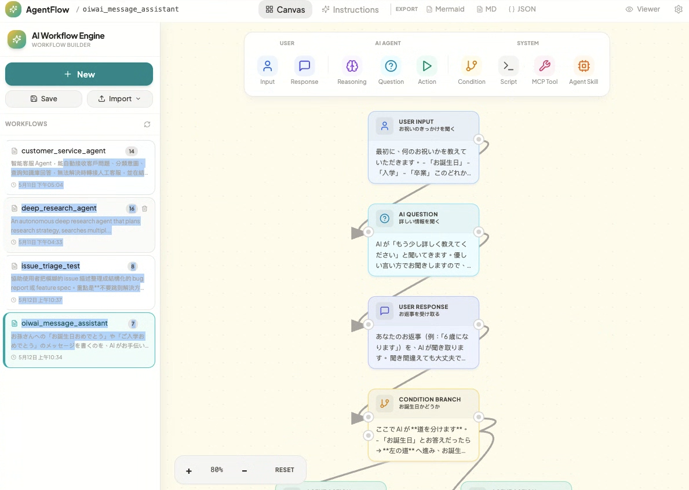
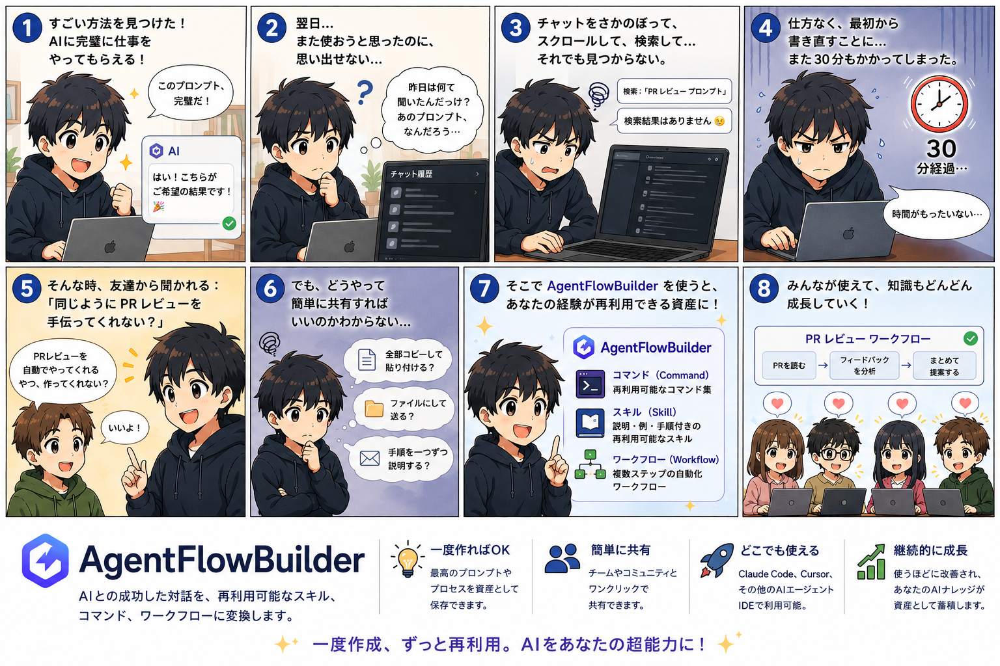

# AgentFlowBuilder

> [English](README.md) · [繁體中文](README.zh-TW.md) · **日本語**



> AI agent ワークフローをビジュアルで設計。Claude Code、Cursor、Antigravity で動く skill / command を生成 — または ChatGPT / Gemini / Grok にそのまま貼れる完結型プロンプトをコピー。コーディング不要。



AgentFlowBuilder は MCP Server + ビジュアル編集器で、フロー図を実運用レベルの AI agent 指示書へ変換します。**あなたはフローを設計、AI アシスタントがコードを書く。**

**API 費用ゼロ。** サーバーは LLM を呼びません — Claude があなたの既存サブスクリプションで推論を行います。

## 新着機能

- **多言語 UI** — English、繁體中文、日本語（設定パネルで切替）
- **Chat モード** — IDE を持たない方のため：「ステップ実行」または「計画してから実行」のプロンプトをコピーして ChatGPT / Gemini / Grok / Claude.ai に貼り付け
- **Read / Walk ビューア** — 任意の workflow.md をきれいな読み物として、またはステージごとに歩く形で表示（分岐プレビュー + Mermaid パスのハイライト付き）
- **どこからでもインポート** — `.md` / `.json` はネイティブ、`.pdf` / `.docx` / `.pptx` / `.xlsx` / `.html` / URL / YouTube は [markitdown](https://github.com/microsoft/markitdown) 経由
- **形式中立ストレージ** — workflow は **JSON（デフォルト）、Markdown、`.mjs`** の 3 つが対等な形式で保存される。`.mjs` と Claude Code dynamic workflow の相互運用は近似エクスポート / ベストエフォートインポートで `AGENTFLOW_MJS` 環境変数で有効化

## なぜ AgentFlowBuilder か



| 課題 | AgentFlowBuilder の解決方法 |
|---|---|
| 複雑な agent プロンプトはミスが多い | ビジュアル node 編集 — ドラッグして繋げて完成 |
| Agent 指示が長くなると context が劣化 | 階層的開示で作業をマイクロタスクへ分解 |
| IDE 間で書き直しが必要 | Claude Code、Cursor、Antigravity 形式へワンクリック出力 |
| AI ツールを自前で動かすとお金がかかる | 100% ローカル MCP Server — サーバー費用ゼロ、API キーゼロ |
| テキストベースのワークフローはレビュー困難 | Mermaid 図 + Markdown ドキュメントを自動生成 |
| 生成 skill の品質がばらつく | 品質ゲートが自動採点・改善し、80/100 点以上のみ公開 |

## Prompt as Code — なぜ重要か

従来のプロンプトエンジニアリングは、巨大なテキストファイルを編集する作業で、誰もレビューできません。AgentFlowBuilder は agent workflow を **構造化データ** として扱います — バージョン管理可能、視覚的に編集可能、自動品質チェック付き。

### バージョン管理可能な workflow

Workflow は `./workflows/` にクリーンなファイルとして保存されます。あなたの agent ロジックがアプリケーションコードと同じエンジニアリング規律を受けられます：

| | 手書きプロンプト | AgentFlowBuilder workflow |
|---|---|---|
| **Git diff** | 文字の壁 — 何が変わったか追えない | 構造化 diff — どの node / edge / condition が変わったか一目瞭然 |
| **コードレビュー** | 長いプロンプトは流し読みされる | 各 node は独立単位 — レビュアーが焦点を絞れる |
| **ブランチ作業** | プロンプト変種をコピペ、混乱する | workflow をブランチ、実験成功で merge |
| **マージコンフリクト** | 1 行ずつ手動解決 | 構造化により conflict が局所化、解きやすい |
| **ロールバック** | 旧版を保存していたら助かる | `git revert` で完了 |

### 視覚的フロー = 同期し続けるドキュメント

Canvas は単なる編集器ではなく **常に同期するドキュメント** です：

- **全体を一目で把握** — プロンプトを延々読まなくて済む
- **ドラッグでステップ挿入** — 検証ステップが必要？既存 node の間にドラッグ
- **分岐ロジックが見える** — Condition node の True/False が本物の視覚分岐として表示
- **新メンバーが瞬時に理解** — 2000 語のプロンプトを読ませる代わりに canvas を見せる
- **Mermaid 図を自動生成** — ドキュメント、wiki、PR 用にワンクリック出力

### Canvas と AI がリアルタイム同期

Web UI と MCP tools が `./workflows/` を共有、**SSE で即時同期**。canvas を編集 → AI が MCP 経由で即座に把握。AI が MCP tools で編集 → canvas が即座に更新。手動リフレッシュ不要、状態ズレなし、信頼できる単一ソース。

### プロジェクト間で skill を発見

Skill を公開すると `~/.claude/skills/{name}/` に保存されます — Claude Code が **どのプロジェクトからも** 自動的に見つける標準位置。メインリポで作った code review skill が、ローカルの全プロジェクトで即使えます。各公開 skill には：

- `SKILL.md` — 運用可能な skill 本体
- `references/workflow.json` — 追跡用の元 workflow
- `references/grading.json` — 品質スコアと採点履歴

### スマート後処理

AI 生成 workflow はいつもきれいとは限りません。後処理パイプラインが自動で：

- **Node ID を正規化** — `Review PR` → `review_pr`
- **エントリポイント検出** — 参照されない node を見つけ、トポロジカルに並べる
- **Canvas 自動レイアウト** — 読みやすいグリッドへ配置
- **Edge を再構築** — node ロジックから視覚接続を再生成
- **Condition 分岐ラベル** — 言語に応じた True/False 表示

### 階層的開示 — Context 劣化を防ぐ

長いプロンプトは context 劣化に悩まされる：AI が最後に到達した時、最初の指示を忘れる。AgentFlowBuilder が生成する skill はすべて **階層的開示** を使用 — 作業を段階に分け、AI は一度に一つのマイクロタスクに集中し、そのステップに必要な context だけを読み込む。結果として複雑な多段プロセスでも確実に実行できます。

### 生成 skill が手書きプロンプトに勝る理由

| | 手書きプロンプト | AgentFlowBuilder Skills |
|---|---|---|
| **バージョン管理** | diff が困難なテキスト塊 | 構造化 — 意味のある diff、容易な merge |
| **視覚レビュー** | 全文を読まないと流れが分からない | Canvas を一瞥で全体把握 |
| **品質保証** | 標準なし、作者の腕次第 | 6 軸品質ゲートが自動採点、80/100 まで改善 |
| **再利用性** | プロジェクト間でコピペ、徐々に乖離 | `~/.claude/skills/` に一度公開、全所で利用 |
| **可搬性** | 特定 IDE にロックイン | Claude Code、Cursor、Antigravity へワンクリック |
| **チーム連携** | 「これが私のプロンプト、頑張って」 | Workflow JSON 共有リポ — PR、review、merge |
| **追跡可能性** | プロンプトの由来不明 | 各 skill に workflow と採点履歴を同梱 |
| **Context 劣化** | 全文一括ロード、後半の指示が忘れられる | 階層的開示、段階実行、focused context |

---

**例：** Canvas で workflow を設計 → Instructions タブへ → IDE を選択（Claude Code / Cursor / Antigravity）→ 出力タイプを選択（Skills / Commands / Workflows）→ Copy SOP Prompt → AgentFlow Builder プロジェクト内の AI ツールに貼り付け → AI が自動で生成、採点、改善、公開。

## クイックスタート

### 1. Clone してインストール

```bash
git clone https://github.com/Guangpop/AgentFlowBuilder.git
cd AgentFlowBuilder
npm install && npm run build
```

### 2. Claude Code に MCP Server として追加

```bash
claude mcp add agentflow -- node /path/to/AgentFlowBuilder/dist/cli.js
```

Claude にこう尋ねます：

```
「カスタマーサポート用 agent ワークフローを作って」
「フィードバックループ付きのコードレビュー ワークフローを生成して」
「私のワークフローを Claude Code skill としてエクスポートして」
```

### 3. ビジュアル編集器

```bash
npm start
```

> **オプション — Claude Code `.mjs` 連携を有効化：** `AGENTFLOW_MJS=1 npm start` で起動します。フォーマットピッカーに `.mjs`（Claude Code dynamic-workflow スクリプト）が対等なインポート／エクスポート形式として追加されます。デフォルトは無効。`.mjs` はエクスポートが近似、インポートがベストエフォートです。

最初の agent skill までの 3 ステップ：

1. **ノードを追加** — カテゴリ別ツールバー（User / Agent / System）からドラッグ
2. **フローを接続** — ノード間にエッジを引いて実行順を定義
3. **SOP プロンプトをコピー** — IDE を選んで Copy、AI ツールに貼り付け

> **IDE / MCP 環境がない場合**：Instructions タブ → **Chat** → **ステップ実行** または **計画してから実行** を選択 → プロンプトをコピー → ChatGPT / Gemini / Grok / Claude.ai に貼り付け、agent がそれに沿って動きます。

### 4. 既存素材のインポート（任意）

サイドバーの **Import** ドロップダウン：

- **ファイルから** — `.md` / `.json` / `.mjs` はネイティブ読み込み、`.pdf` / `.docx` / `.pptx` / `.xlsx` / `.html` / 画像は markitdown でテキスト抽出後、workflow ドラフトに整形
- **URL から** — 任意の URL または YouTube リンク（YouTube は字幕抽出）

バイナリ形式を扱うには先に markitdown をインストール：

```bash
uv tool install 'markitdown[all]'
# または
pipx install 'markitdown[all]'
```

## 機能

- **9 種類のノード** — シンプルな Q&A から複雑な分岐ロジックまで agent パターンを網羅
- **ビジュアル canvas 編集器** — pan、zoom、ドラッグで接続、リアルタイムプレビュー
- **マルチ IDE 出力** — Claude Code、Cursor、Antigravity 用の Skills / Commands / Workflows
- **Chat モード** — IDE を持たないユーザー向けの完結型プロンプト
- **Read / Walk ビューア** — workflow.md を読み物 / 歩行モードで表示
- **Skill 品質ゲート** — 6 軸採点で自動改善、≥ 80/100 で `~/.claude/skills/` に公開
- **MCP Server** — 12 ツールが任意の MCP 対応 AI から利用可能
- **ファイルシステム即時同期** — Web UI と MCP が `./workflows/` を共有、SSE で更新
- **Mermaid + Markdown** — 図とドキュメントを自動生成
- **多言語** — UI は en / zh-TW / ja に対応
- **完全ローカル** — クラウド不要、アカウント不要、API キー不要

## ノード種別

| カテゴリ | ノード | 用途 |
|----------|------|---------|
| **User** | User Input | エントリ — ユーザー要求の受領 |
| | User Response | 補足情報の収集 |
| **Agent** | Agent Reasoning | AI による推論と判断 |
| | Agent Question | AI が確認の質問 |
| | Agent Action | タスクを実行 |
| **System** | Condition | True/False 分岐 |
| | Script Execution | Python / Shell / Node.js を実行 |
| | MCP Tool | 外部 MCP ツールを呼び出し |
| | Agent Skill | 再利用可能な agent skill を発動 |

## 出力形式

| 形式 | 用途 |
|--------|---------|
| **Skills** (.md) | YAML frontmatter 付き再利用可能 agent 能力 |
| **Commands** (.md) | ユーザー入力で起動する slash command |
| **Workflows** (.md) | 段階的な実行計画 |
| **JSON** | デフォルトの正規 workflow 形式 |
| **MJS** | Claude Code dynamic-workflow スクリプト（近似エクスポート / ベストエフォートインポート、`AGENTFLOW_MJS` 必須） |
| **Markdown** | システム設計ドキュメント |
| **Mermaid** | ビジュアルフロー図 |

## MCP ツール一覧

| ツール | 説明 |
|------|-------------|
| `get_node_types` | 利用可能ノード種別とスキーマ |
| `get_generation_guide` | Workflow 生成用プロンプトテンプレートと JSON スキーマ |
| `validate_workflow` | Workflow 構造の検証 |
| `post_process_workflow` | ID 整形、自動レイアウト、edge 再構築 |
| `save_workflow` | `./workflows/` へ保存 |
| `load_workflow` | `./workflows/` から読み込み |
| `list_workflows` | 全 workflow を一覧 |
| `export_workflow` | JSON / Markdown / Mermaid / .mjs 出力 |
| `get_instruction_template` | Agent 指示書生成用プロンプト |
| `convert_to_skill` | Workflow を SKILL.md ドラフトと品質ゲート指示に変換 |
| `get_skill_quality_gate` | 採点 / 改善 / description 最適化プロンプトを取得 |
| `publish_skill` | 品質確認済 skill を `~/.claude/skills/` に公開 |

## 開発

```bash
git clone https://github.com/Guangpop/AgentFlowBuilder.git
cd AgentFlowBuilder
npm install

npm run build          # 全体ビルド
npm run dev:mcp        # MCP server dev モード
npm run dev:web        # Web UI dev モード（HMR）
```

## 貢献

貢献歓迎！変更内容について先に issue を開いて議論してから動いてください。
