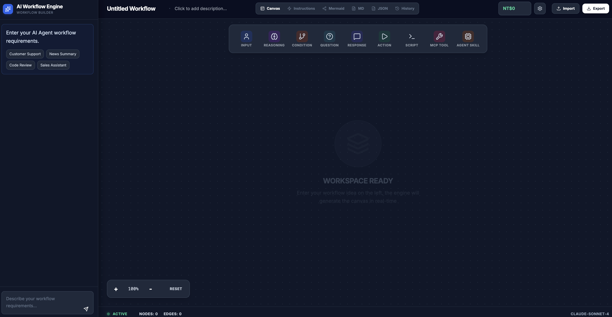

# Agent Flow Builder

A visual node-based workflow editor that converts natural language descriptions into structured AI agent workflows. Built with React 19 + TypeScript + Vite.



## Features

- **AI-Powered Workflow Generation** - Describe your workflow in natural language, AI generates the node structure
- **Visual Canvas Editor** - Drag, connect, and edit nodes with an intuitive interface
- **SOP Generation** - Convert workflows into detailed Agent SOP instructions
- **Multiple Export Formats** - JSON, Markdown, Mermaid diagrams
- **Multi-language Support** - Traditional Chinese (繁體中文) and English

## Node Types

- User Input / User Response
- AI Reasoning / AI Question
- Condition Branch
- Agent Action
- Script Execution (Python, Shell, Node.js)
- MCP Tool
- Agent Skill

## Tech Stack

- **Frontend**: React 19, TypeScript, Vite, Tailwind CSS
- **AI**: Claude API (via Vercel serverless functions)
- **Database**: Supabase (PostgreSQL)
- **Payment**: TapPay (Taiwan)
- **Deployment**: Vercel

## Local Development

### Prerequisites

- Node.js 18+
- npm or pnpm

### Setup

1. Clone the repository
2. Install dependencies:
   ```bash
   npm install
   ```
3. Copy `.env.example` to `.env.local` and fill in your values:
   ```bash
   cp .env.example .env.local
   ```
4. Start the development server:
   ```bash
   npm run dev
   ```

The app will be available at `http://localhost:3000`.

### Environment Variables

See `.env.example` for all available configuration options.

**Local Development:**
- `VITE_LOCAL_API_KEY` - Your Claude API key for local testing
- `VITE_SUPABASE_URL` - Supabase project URL
- `VITE_SUPABASE_ANON_KEY` - Supabase anonymous key

**Production (Vercel Dashboard only):**
- `ANTHROPIC_API_KEY` - Backend Claude API key
- `SUPABASE_SERVICE_ROLE_KEY` - Backend Supabase admin key
- `TAPPAY_PARTNER_KEY` - TapPay payment integration
- `TAPPAY_MERCHANT_ID` - TapPay merchant ID

## Commands

```bash
npm run dev      # Start dev server (port 3000)
npm run build    # Production build
npm run preview  # Preview production build
```

## Architecture

```
├── api/                    # Vercel serverless functions
│   ├── generate-workflow.ts
│   ├── generate-sop.ts
│   └── payment/
├── components/             # React components
│   ├── WorkflowCanvas.tsx  # Main canvas with nodes/edges
│   ├── ChatSidebar.tsx     # AI prompt input
│   └── NodeProperties.tsx  # Node editor panel
├── contexts/               # React contexts
├── locales/                # i18n translations
├── lib/                    # Utility libraries
├── prompts/                # AI prompt templates
└── services/               # AI service integrations
```

## License

MIT
