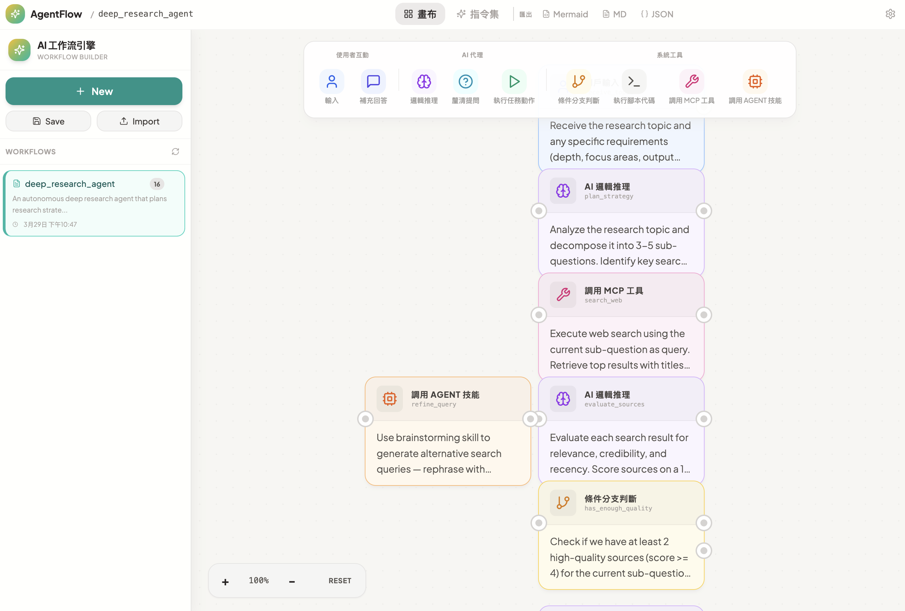

# AgentFlowBuilder

> Design AI agent workflows visually. Generate executable skills and commands for Claude Code, Cursor, and Antigravity — no coding required.



AgentFlowBuilder is an MCP Server + visual editor that turns workflow diagrams into production-ready AI agent instructions. You design the flow, your AI assistant writes the code.

**Zero API cost.** The server makes no LLM calls — Claude does all the reasoning using your existing subscription.

## Why AgentFlowBuilder?

| Pain Point | How AgentFlowBuilder Solves It |
|---|---|
| Writing complex agent prompts is error-prone | Visual node editor — drag, connect, done |
| Agent instructions get long and context decays | Hierarchical Disclosure breaks work into micro-tasks |
| Sharing workflows across IDEs requires rewriting | Export to Claude Code, Cursor, or Antigravity format in one click |
| Hosting AI tools costs money | Runs 100% locally as an MCP Server — zero server cost, zero API keys |
| Text-based workflows are hard to review | Mermaid diagrams + Markdown docs generated automatically |

**Example:** Design a workflow on the canvas → switch to the Instructions tab → select your IDE (Claude Code, Cursor, or Antigravity) → choose output type (Skills, Commands, or Workflows) → click Copy SOP Prompt → paste into your AI tool to generate the file.

## Quick Start

### 1. Clone and install

```bash
git clone https://github.com/Guangpop/AgentFlowBuilder.git
cd AgentFlowBuilder
npm install && npm run build
```

### 2. Add to Claude Code as MCP Server

```bash
claude mcp add agentflow -- node /path/to/AgentFlowBuilder/dist/cli.js
```

Then ask Claude:

```
"Help me build a customer support agent workflow"
"Generate a code review workflow with feedback loops"
"Export my workflow as Claude Code skills"
```

### 3. Visual Editor

```bash
node dist/cli.js serve
```

Three steps to your first agent skill:

1. **Add nodes** — drag from the categorized toolbar (User / Agent / System)
2. **Connect the flow** — draw edges between nodes to define execution order
3. **Copy SOP prompt** — choose your IDE, click Copy, paste into your AI tool

## Use Cases

### Customer Support Agent
Design a flow: User Input → AI Reasoning → Condition (sentiment check) → Agent Action (resolve) or Agent Question (escalate). Generate a skill that handles tickets end-to-end.

### Code Review Pipeline
Build a multi-step reviewer: Script Execution (run linter) → Agent Reasoning (analyze results) → Condition (pass/fail) → Agent Action (approve or request changes). Export as a Claude Code command.

### Research & Summarization
Chain together: User Input (topic) → MCP Tool (web search) → Agent Reasoning (synthesize) → Agent Action (write report). Works with any MCP-compatible search tool.

### Sales Lead Qualification
Route incoming leads: User Input → Agent Question (gather info) → Condition (qualified?) → Agent Skill (CRM update) or Agent Action (follow-up email).

### Onboarding Automation
Guide new users step-by-step: User Input → Agent Question (role?) → Condition (department routing) → Agent Action (provision accounts) → Agent Skill (send welcome kit).

## Features

- **9 node types** — cover every agent pattern from simple Q&A to complex branching logic
- **Visual canvas editor** — pan, zoom, drag-to-connect with real-time preview
- **Multi-IDE export** — generate Skills, Commands, or Workflows for Claude Code, Cursor, and Antigravity
- **MCP Server** — 9 tools accessible from any MCP-compatible AI assistant
- **File system sync** — web UI and MCP tools share `./workflows/` with live SSE updates
- **Mermaid + Markdown** — auto-generated diagrams and documentation
- **Fully local** — no cloud, no accounts, no API keys

## Node Types

| Category | Node | Purpose |
|----------|------|---------|
| **User** | User Input | Entry point — receives user request |
| | User Response | Collects follow-up information |
| **Agent** | Agent Reasoning | AI logic and decision-making |
| | Agent Question | AI asks clarifying questions |
| | Agent Action | Executes a task |
| **System** | Condition | True/False branching |
| | Script Execution | Run Python, Shell, or Node.js |
| | MCP Tool | Call external MCP tools |
| | Agent Skill | Invoke reusable agent skills |

## Export Formats

| Format | Use For |
|--------|---------|
| **Skills** (.md) | Reusable agent capabilities with YAML frontmatter |
| **Commands** (.md) | Slash commands triggered by user input |
| **Workflows** (.md) | Step-by-step execution plans |
| **JSON** | Raw workflow data for backup or sharing |
| **Markdown** | System design documentation |
| **Mermaid** | Visual flow diagrams |

## MCP Tools Reference

| Tool | Description |
|------|-------------|
| `get_node_types` | Available node types and their schemas |
| `get_generation_guide` | Prompt template + JSON schema for workflow generation |
| `validate_workflow` | Structural validation of a workflow |
| `post_process_workflow` | ID cleanup, auto-layout, edge rebuilding |
| `save_workflow` | Save workflow to `./workflows/` |
| `load_workflow` | Load workflow from `./workflows/` |
| `list_workflows` | List all saved workflows |
| `export_workflow` | Export as JSON, Markdown, or Mermaid |
| `get_instruction_template` | Prompt template for generating agent instructions |

## Architecture

```
src/
├── shared/       # Types, validation, export, prompts, schema
├── mcp/          # MCP Server (stdio transport)
├── web/          # Express server + SSE file watching
├── web-app/      # React 19 + Vite visual editor
└── cli.ts        # CLI entry (mcp default, serve subcommand)
```

## Development

```bash
git clone https://github.com/Guangpop/AgentFlowBuilder.git
cd AgentFlowBuilder
npm install

npm run build          # Build everything
npm run dev:mcp        # Dev MCP server
npm run dev:web        # Dev web UI (with HMR)
```

## Contributing

Contributions welcome! Please open an issue first to discuss what you'd like to change.

## License

MIT
