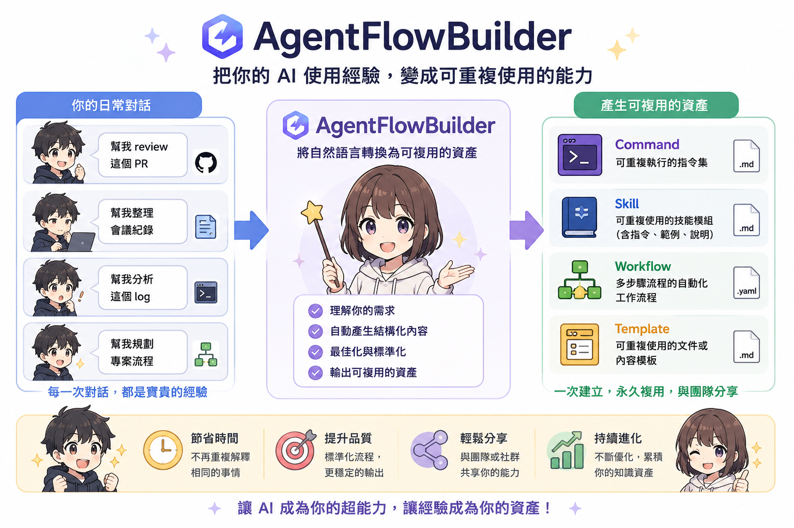
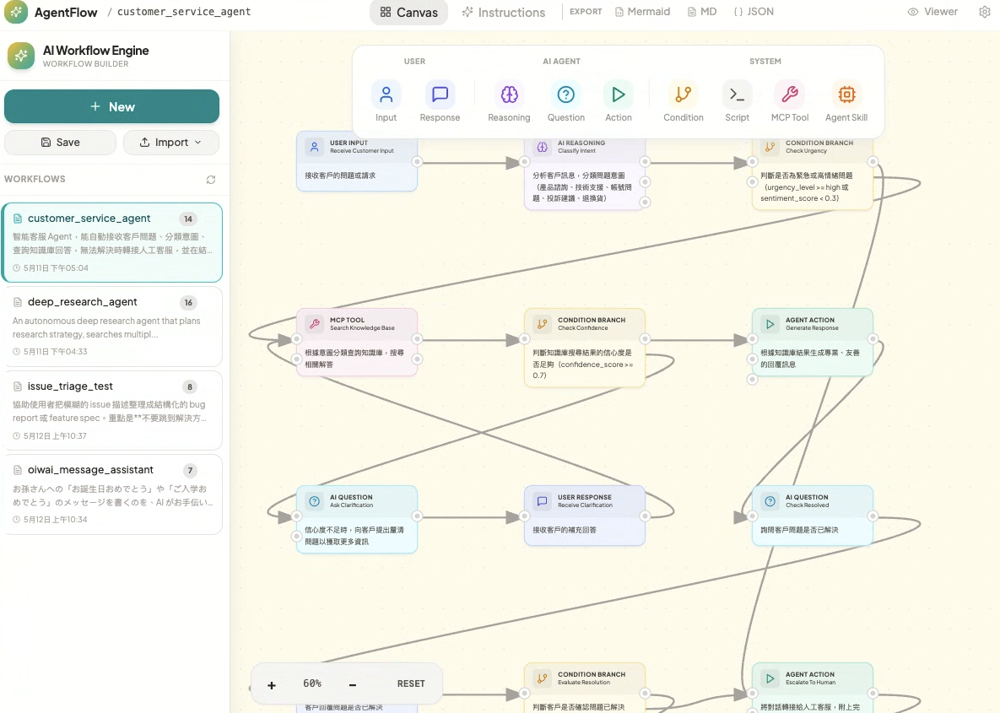

# AgentFlowBuilder

> [English](README.md) · **繁體中文** · [日本語](README.ja.md)



> 用視覺化方式設計 AI agent workflow。產出可直接執行的 skill 與 command，給 Claude Code、Cursor、Antigravity 用 — 或複製一段自我完整的 prompt，貼到 ChatGPT / Gemini / Grok。完全不需要寫程式。



AgentFlowBuilder 是一個 MCP Server + 視覺化編輯器，把流程圖轉成可直接投產的 AI agent 指令集。**你設計流程，AI 助手寫程式碼。**

**零 API 費用。** Server 不打任何 LLM — Claude 用你既有的訂閱完成所有推理。

## 這輪新增

- **多語系 UI** — 英文、繁體中文、日本語（設定面板切換）
- **Chat 模式** — 沒有 IDE 的人也能用：複製一段「逐步互動」或「先計畫再執行」的 prompt，貼到 ChatGPT / Gemini / Grok / Claude.ai
- **Read & Walk 檢視器** — 把任何 workflow.md 渲染成乾淨閱讀版，或一步一步走訪、含分支預覽與 Mermaid 路徑高亮
- **匯入任何來源** — `.md` / `.json` 直接讀，`.pdf` / `.docx` / `.pptx` / `.xlsx` / `.html` / URL / YouTube 透過 [markitdown](https://github.com/microsoft/markitdown)
- **格式中立儲存** — workflow 以 **JSON（預設）、Markdown、`.mjs`** 三種對等格式儲存；`.mjs` 與 Claude Code dynamic workflow 的互通為近似匯出 / 最佳努力匯入，由 `AGENTFLOW_MJS` 環境變數控管

## 為什麼用 AgentFlowBuilder？


| 痛點 | AgentFlowBuilder 怎麼解 |
|---|---|
| 寫複雜的 agent prompt 容易出錯 | 視覺化節點編輯器 — 拖、連、完成 |
| Agent 指令一長就 context 衰退 | 「階層式揭露」把工作拆成微任務 |
| 不同 IDE 之間切換要重寫 prompt | 一鍵匯出 Claude Code、Cursor 或 Antigravity 格式 |
| AI 工具自架要錢 | 100% 本機跑、MCP Server — 零伺服器成本、零 API key |
| 純文字工作流難審查 | 自動生成 Mermaid 圖表 + Markdown 文件 |
| 產出的 skill 品質不一 | 內建品質閘 — 自動評分、迭代，達 80/100 才發佈 |

## Prompt as Code — 這件事為什麼重要

傳統的 prompt 工程就是改超大文字檔，沒人 review 得了。AgentFlowBuilder 把 agent workflow 當成**結構化資料**處理 — 版本控管、視覺化編輯、自動品檢。

### 版本控管的 workflow

Workflows 以乾淨的檔案存在 `./workflows/`。意思是你的 agent 邏輯能享有跟應用程式碼一樣的工程嚴謹度：

| | 手寫 prompt | AgentFlowBuilder workflow |
|---|---|---|
| **Git diff** | 一整面文字牆 — 找不出哪邊變了 | 結構化 diff — 哪個 node / edge / condition 改了一目了然 |
| **Code review** | reviewer 看到長 prompt 就跳過 | 每個 node 是獨立單元 — reviewer 可以聚焦 |
| **Branching** | 複製貼上 prompt 變體、立刻失控 | 直接 branch workflow 檔，實驗成功再 merge |
| **Merge conflict** | 一行一行手動解 | 結構化讓 conflict 局部化、好解 |
| **回滾** | 希望你有存舊版 | `git revert` 完事 |

### 視覺流程 = 永遠同步的文件

Canvas 不只是編輯器 — 它就是文件，永遠跟工作流本身同步：

- **一眼看完整段邏輯** — 不必滾過好幾頁 prompt 才搞懂在幹嘛
- **拖一個 node 進去就插入步驟** — 想加驗證步驟？拖一個進兩個既有 node 中間
- **分支邏輯直接看得到** — Condition node 的 True/False 是真實的視覺分支，不是被埋在文字裡的 `if`
- **新成員一秒上手** — 給他看 canvas，不必叫他讀兩千字的 prompt
- **自動產 Mermaid 圖** — 一鍵匯出視覺圖給文件、wiki、PR 用

### Canvas 跟 AI 即時同步

Web UI 跟 MCP tools 共用同一個 `./workflows/` 目錄，**SSE 即時同步**。canvas 改 → AI 助手透過 MCP 立刻看到。AI 用 MCP tools 改 → canvas 即時更新。沒有手動 refresh、沒有 stale state，一份單一真相來源。

### 跨專案的 skill 發現

發佈 skill 時會丟到 `~/.claude/skills/{name}/` — 這個標準位置 Claude Code 在**任何專案**都自動找得到。在主 repo 做一個 code review skill，所有專案立刻能用。每個發佈的 skill 包含：

- `SKILL.md` — 可直接使用的 skill 檔
- `references/workflow.json` — 原始 workflow，可追溯
- `references/grading.json` — 品質分數與評分歷程

### 智慧後處理

AI 生成的 workflow 不一定乾淨。後處理 pipeline 自動：

- **node ID 標準化** — `Review PR` → `review_pr`
- **找進入點** — 找出沒被引用的 node 並拓樸排序
- **自動排版** — 把 node 排成易讀格子，不用手動拉
- **重建邊** — 從 node 邏輯重組視覺連線，確保 canvas 一致
- **標 condition 分支** — 用你的語言自動加 True/False 標籤

### 階層式揭露 — 不再 context 衰退

長 prompt 會 context decay：AI 讀到底就忘了開頭。AgentFlowBuilder 產的每個 skill 都用**階層式揭露** — 把工作拆成階段，AI 每次只專注一個微任務，只載入該步驟需要的 context。結果就是：複雜多步驟流程也能穩定執行。

### 為什麼產出的 skill 比手寫 prompt 好

| | 手寫 prompt | AgentFlowBuilder Skills |
|---|---|---|
| **版本控管** | 難 diff 的純文字塊 | 結構化 — diff 有意義、merge 簡單 |
| **視覺檢閱** | 讀完整段才懂流程 | 看一眼 canvas 就掌握全貌 |
| **品質保證** | 無標準、看作者品味 | 6 支柱品質閘自動評分、迭代到 ≥ 80/100 |
| **重用性** | 跨專案複製貼上、慢慢分歧 | 一次發佈到 `~/.claude/skills/`、處處可用 |
| **可攜性** | 鎖定一個 IDE | 一鍵匯出 Claude Code、Cursor、Antigravity |
| **團隊協作** | 「這是我的 prompt，加油」 | workflow JSON 共享 repo — PR / review / merge |
| **可追溯性** | 不知道 prompt 為什麼長這樣 | 每個發佈的 skill 都附 workflow + 評分歷程 |
| **Context 衰退** | 整段一次塞、後半被遺忘 | 階層式揭露、分階段執行、focused context |

---

**範例：** 在 canvas 設計 workflow → 切到 Instructions tab → 選 IDE（Claude Code / Cursor / Antigravity）→ 選輸出類型（Skills / Commands / Workflows）→ 按 Copy SOP Prompt → 貼到 AgentFlow Builder 專案目錄的 AI 工具 → AI 自動產生、評分、改善、發佈 skill。

## 快速開始

### 1. Clone 並安裝

```bash
git clone https://github.com/Guangpop/AgentFlowBuilder.git
cd AgentFlowBuilder
npm install && npm run build
```

### 2. 加進 Claude Code 當 MCP Server

```bash
claude mcp add agentflow -- node /path/to/AgentFlowBuilder/dist/cli.js
```

然後跟 Claude 說：

```
「幫我做一個客服 agent 工作流」
「做一個有反饋回圈的 code review 工作流」
「把我的工作流匯出成 Claude Code skills」
```

### 3. 視覺化編輯器

```bash
npm start
```

三步建立你的第一個 agent skill：

1. **加入節點** — 從分類好的工具列拖（User / Agent / System）
2. **連接流程** — 在節點間畫邊定義執行順序
3. **複製 SOP prompt** — 選 IDE、按 Copy、貼到 AI 工具

> **如果你沒有 IDE / MCP 環境**：切到 Instructions tab → 選 **Chat** → 選 **逐步互動** 或 **先計畫再執行** → 複製 prompt → 貼到 ChatGPT / Gemini / Grok / Claude.ai，agent 就會照著走。

### 4. 匯入既有素材（選用）

側邊欄 **Import** 下拉：

- **從檔案** — `.md` / `.json` / `.mjs` 原生讀；`.pdf` / `.docx` / `.pptx` / `.xlsx` / `.html` / 圖片透過 markitdown 抽出文字後轉成 workflow 草稿
- **從 URL** — 任意網址或 YouTube 連結（YouTube 抓字幕）

要支援 binary 格式，請先裝 markitdown：

```bash
uv tool install 'markitdown[all]'
# 或
pipx install 'markitdown[all]'
```

## 功能特性

- **9 種節點** — 涵蓋所有 agent pattern，從簡單 Q&A 到複雜分支邏輯
- **視覺化 canvas 編輯器** — pan、zoom、拖拉連線、即時預覽
- **多 IDE 匯出** — Claude Code、Cursor、Antigravity 的 Skills / Commands / Workflows
- **Chat 模式** — 為沒有 IDE 的人產 self-contained prompt
- **Read / Walk 檢視器** — 把 workflow.md 渲染成閱讀版或走訪版
- **Skill 品質閘** — 6 支柱評分、自動迭代到 ≥ 80/100、發佈到 `~/.claude/skills/`
- **MCP Server** — 12 個工具，任何 MCP-compatible AI 都能用
- **檔案系統即時同步** — web UI 跟 MCP 共用 `./workflows/`，SSE 即時更新
- **Mermaid + Markdown** — 自動產生圖表跟文件
- **多語系** — UI 支援 en / zh-TW / ja
- **完全本機** — 沒有雲、沒有帳號、沒有 API key

## 節點類型

| 分類 | 節點 | 用途 |
|----------|------|---------|
| **User** | User Input | 入口 — 接收使用者請求 |
| | User Response | 收集後續資訊 |
| **Agent** | Agent Reasoning | AI 邏輯與決策 |
| | Agent Question | AI 提問釐清 |
| | Agent Action | 執行任務 |
| **System** | Condition | True/False 分支 |
| | Script Execution | 跑 Python / Shell / Node.js |
| | MCP Tool | 呼叫外部 MCP 工具 |
| | Agent Skill | 觸發可重用的 agent skill |

## 匯出格式

| 格式 | 用途 |
|--------|---------|
| **Skills** (.md) | 帶 YAML frontmatter 的可重用 agent 能力 |
| **Commands** (.md) | 使用者輸入觸發的 slash command |
| **Workflows** (.md) | 一步一步的執行計畫 |
| **JSON** | 預設正式 workflow 格式 |
| **MJS** | Claude Code dynamic-workflow 腳本（近似匯出／最佳努力匯入，需 `AGENTFLOW_MJS`） |
| **Markdown** | 系統設計文件 |
| **Mermaid** | 視覺流程圖 |

## MCP 工具參考

| 工具 | 說明 |
|------|-------------|
| `get_node_types` | 取得可用節點型別與 schema |
| `get_generation_guide` | 產 workflow 的 prompt 模板 + JSON schema |
| `validate_workflow` | workflow 結構驗證 |
| `post_process_workflow` | ID 清整、自動排版、邊重建 |
| `save_workflow` | 存到 `./workflows/` |
| `load_workflow` | 從 `./workflows/` 載入 |
| `list_workflows` | 列出所有 workflow |
| `export_workflow` | 匯出 JSON / Markdown / Mermaid / .mjs |
| `get_instruction_template` | 產 agent instruction 的 prompt 模板 |
| `convert_to_skill` | 把 workflow 轉成 SKILL.md 草稿 + 品質閘指令 |
| `get_skill_quality_gate` | 取得評分 / 改善 / description 優化 prompt |
| `publish_skill` | 發佈通過品檢的 skill 到 `~/.claude/skills/` |

## 開發

```bash
git clone https://github.com/Guangpop/AgentFlowBuilder.git
cd AgentFlowBuilder
npm install

npm run build          # 整套 build
npm run dev:mcp        # MCP server dev 模式
npm run dev:web        # Web UI dev 模式（含 HMR）
```

## 貢獻

歡迎貢獻！麻煩先開 issue 討論要改什麼再動手。
